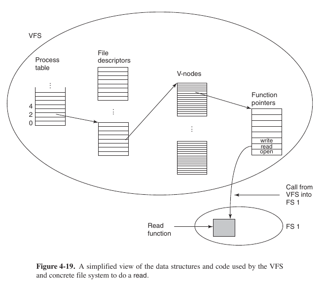

#### Task 1

Which of the following is TRUE about file extensions in UNIX
Select one:
- ```May or may not be enforced by the operating system, depends on flavor of Unix```
- ```File extensions are not enforced by the Operating system ``` <- **Correct**
- ```File extensions are always enforced by the operating system without user intervention```
- ```Creator/user of the file gives permission for handling file extensions to operating system by setting extension bit```
- ```A file extension depends on the value of file extension bit for user or operating system```

Extension is a part of file name, it is not stored in [i-node](https://ru.wikipedia.org/wiki/Inode), the extension in Unix is not obligatory.

#### Task 2

Which of the following is/are **FALSE** about path name conventions?
Select one or more:
- ```The absolute path name will always work, no matter what the working directory is.``` -. **True**
- ```If the first character of the path name is the separator, then the path is absolute.``` -> **True**
- ```The relative form of path does the same thing as absolute form of path.``` -> **True**
- ```".." refers to the current directory. ``` ->  **Nope**: ```.``` refers to current dir, ```..``` refers to upper dir
- ```If a process changes its working directory, then all other process are affected. ``` -> Idk

#### Task 3

Which of the following is/are **TRUE** about _symbolic link_?
Select one or more:
- ```Users with symbolic links to the file, just have i-node pointers and path names.``` <- **Nope**, i-node pointer is _hard link_
- ```There is no difference between a symbolic link and a hard link.``` <- **Nope**, obvoiusly
- ```Symbolic link cannot cross disk boundaries. ``` <- **Nope**, it could: only _hard link_ cannot cross partition boundaries (because i-node could match&collide).
- ```Removing a symbolic link does not affect the file at all.``` <- **True**
- ```Users who have linked to the file just have path names, not i-node pointers. ``` <- **True**

**What is Soft Link And Hard Link In Linux?**

A symbolic or soft link is an actual link to the original file, whereas a hard link is a mirror copy of the original file. If you delete the original file, the soft link has no value, because it points to a non-existent file. But in the case of hard link, it is entirely opposite. Even if you delete the original file, the hard link will still has the data of the original file. Because hard link acts as a mirror copy of the original file.

In a nutshell, a **soft link**

- ```can cross the file system```
- ```allows you to link between directories```
- ```has different inode number and file permissions than original file```
- ```permissions will not be updated```
- ```has only the path of the original file, not the contents```

A **hard link**

- ```can't cross the file system boundaries (i.e. A hardlink can only work on the same filesystem)```
- ```can't link directories```
- ```has the same inode number and permissions of original file```
- ```permissions will be updated if we change the permissions of source file```
- ```has the actual contents of original file, so that you still can view the contents, even if the original file moved or removed```

[Ref1](https://ostechnix.com/explaining-soft-link-and-hard-link-in-linux-with-examples), 
[Ref2](https://www.geeksforgeeks.org/difference-between-hard-link-and-soft-link)

#### Task 4

Which of the following is/are **FALSE** for virtual file systems? Select one or more:
- ```Most VFS implementations are essentially object oriented even if they are written in C rather than C++. ``` <- **False**
- ```The VFS has a lower interface to user processes and it is the POSIX interface. ``` <- **False**, it is upper interface for user processes
- ```The VFS has an upper interface to the concrete file systems. ``` <- **True**
- ```VFS involves creation of vnode. ``` <- **True**, obviously
- ```VFS has internal data structures such as mount table and an array of file descriptors to keep track of open files in the user processes. ``` <- **True**, vfs contains info about fd, open files, vnodes, table of pointers.

> Internally, most VFS implementations are essentially object oriented, even if they are written in C rather than C++.

>  In addition, the VFS has some internal data structures for its own use, including the mount table and an array of file descriptors to keep track of all the open files in the user processes.

Tanenbaum, 296.



#### Task 5

Which of the following do NOT describe bitmap characteristics? Select one or more:

- ```Bitmap is a free space management technique.```
- ```Bitmap always requires less space than linked list model even when the disk is nearly full.```
- ```A disk with n blocks requires a bitmap with size of n2```
- ```Bitmap requires less space than linked lists, except when the disk is nearly full.```
- ```Free blocks may be represented by 0's and allocated blocks may be represented by 1's in the map or vice versa.```

#### Task 6

#### Task 7


#### Task 9


#### Task 10

