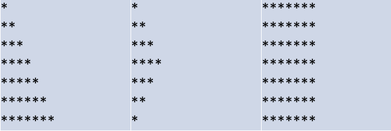

{
 "cells": [],
 "metadata": {
  "kernelspec": {
   "display_name": "Python 3",
   "language": "python",
   "name": "python3"
  },
  "language_info": {
   "codemirror_mode": {
    "name": "ipython",
    "version": 2
   },
   "file_extension": ".py",
   "mimetype": "text/x-python",
   "name": "python",
   "nbconvert_exporter": "python",
   "pygments_lexer": "ipython2",
   "version": "2.7.6"
  },
  "pycharm": {
   "stem_cell": {
    "cell_type": "raw",
    "source": [
     "\n",
     "\n",
     "#### Exercise 1\n",
     "\n",
     "Create a program that declares ```integer```, ```float``` and ```double``` variables\n",
     "- Find out how to assign maximum values for each variable (hint: use ```INT_MAX``` for integer, etc.)\n",
     "- Print sizes and values of each variable\n",
     "- Discuss the results\n",
     "\n",
     "Note: use tutorial as your primary reference\n",
     "\n",
     "\n",
     "\n",
     "#### Solution 1\n",
     "\n",
     "```INT_MAX, FLT_MAX, DBL_MAX``` - predefined constants from ```limits.h``` library.\n",
     "\n",
     "```\n",
     "#include <stdio.h>\n",
     "#include <limits.h>\n",
     "#include <float.h>\n",
     "\n",
     "int main(int argc, char const *argv[])\n",
     "{\n",
     "\tint a = INT_MAX;\n",
     "\tfloat b = FLT_MAX;\n",
     "\tdouble c = DBL_MAX;\n",
     "\n",
     "\tprintf(\"Max int: %d, size: %ld bytes\\n\", a, sizeof(a));\n",
     "\tprintf(\"Max float: %f, size: %ld bytes\\n\", b, sizeof(b));\n",
     "\tprintf(\"Max double: %f, size: %ld bytes\\n\", c, sizeof(c));\n",
     "\n",
     "\treturn 0;\n",
     "}\n",
     "```\n",
     "\n",
     "\n",
     "\n",
     "#### Exercise 2\n",
     "\n",
     "Write a program that prompts the user for a string, and prints its reverse.\n",
     "\n",
     "Hints:\n",
     "- a string in C is an **array** of chars (more about arrays next week)\n",
     "- use ```strlen()``` function to get the **length** of a string\n",
     "- you can use ```printf()```, ```puts()``` or even ```putchar()``` functions to print\n",
     "\n",
     "\n",
     "\n",
     "#### Solution 2\n",
     "\n",
     "#include <stdio.h>\n",
     "#include <string.h>\n",
     "\n",
     "```\n",
     "int main()\n",
     "{\n",
     "\tchar a[100]; // allocate memory in stack for string\n",
     "\tscanf(\"%s\", a); // read string from console\n",
     "\n",
     "\t// print in reverse order characters\n",
     "\tfor (int i = strlen(a); i >= 0; i = i - 1)\n",
     "\t\tprintf(\"%c\", *(a + i));\n",
     "\tprintf(\"\\n\");\n",
     "\n",
     "\treturn 0;\n",
     "}\n",
     "```\n",
     "\n",
     "\n",
     "\n",
     "#### Exercise 3\n",
     "\n",
     "Write a function that outputs a right-side-up triangle of height ```n``` and width ```2n-1```. Your program must accept n as a command line parameter; the output for ```n = 6``` would be:\n",
     "\n",
     "```\n",
     "     *\n",
     "    ***\n",
     "   *****\n",
     "  *******\n",
     " *********\n",
     "***********\n",
     "```\n",
     "\n",
     "Hint: use ```sscanf()``` to convert ```string``` to ```int```\n",
     "\n",
     "\n",
     "\n",
     "\n",
     "#### Solution 3\n",
     "\n",
     "Example of executing the program: ```./some_file 6```\n",
     "\n",
     "```\n",
     "#include <stdio.h>\n",
     "#include <stdlib.h>\n",
     "int main(int argc, char const *argv[])\n",
     "{\n",
     "\tint n;\n",
     "\tsscanf(argv[1], \"%d\", &n); // reading from argv n - number of stars\n",
     "\n",
     "\tfor (int i = 1; i < n + 1; ++i)\n",
     "\t{\n",
     "\t\tfor (int j = 1; j < i + 1; ++j)\n",
     "\t\t{\n",
     "\t\t\tprintf(\"*\");\n",
     "\t\t}\n",
     "\t\tprintf(\"\\n\");\n",
     "\t}\n",
     "\treturn 0;\n",
     "}\n",
     "```\n",
     "\n",
     "\n",
     "\n",
     "#### Exercise 4\n",
     "\n",
     "Write a program that asks user to input two integers and swaps them using a separate function.\n",
     "Hint: you will need to pass parameters by reference (by pointer I think he meant).\n",
     "\n",
     "\n",
     "\n",
     "\n",
     "#### Solution 4\n",
     "\n",
     "```\n",
     "#include <stdio.h>\n",
     "\n",
     "// Custom implementation of swap function, that inputs 2 pointers\n",
     "void _swap(int* a, int* b)\n",
     "{\n",
     "\tint c = *a;\n",
     "\t*a = *b;\n",
     "\t*b = c;\n",
     "}\n",
     "\n",
     "int main(int argc, char const *argv[])\n",
     "{\n",
     "\tprintf(\"Enter 2 numbers: \");\n",
     "\tint a, b;\n",
     "\tscanf(\"%d %d\", &a, &b); // reading 2 int numbers\n",
     "\n",
     "\t_swap(&a, &b); // pass ptr to them in calling function\n",
     "\n",
     "\tprintf(\"Output: %d %d\\n\", a, b); // outputting numbers\n",
     "\n",
     "\treturn 0;\n",
     "}```\n",
     "\n",
     "\n",
     "\n",
     "#### Exercise 5\n",
     "\n",
     "Add several functions to your ```ex3.c``` file, so user could print different figures on his choice; examples are:\n",
     "\n",
     "\n",
     "\n",
     "\n",
     "\n",
     "#### Solution 5\n",
     "\n",
     "To be added\n",
     "\n",
     "\n"
    ],
    "metadata": {
     "collapsed": false
    }
   }
  }
 },
 "nbformat": 4,
 "nbformat_minor": 0
}