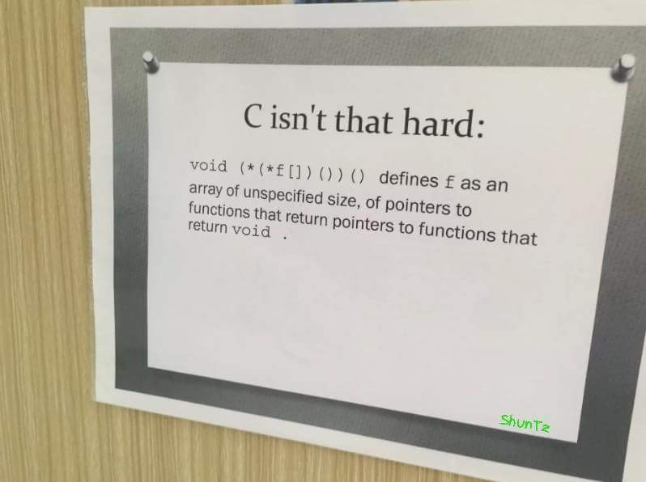

{
 "cells": [],
 "metadata": {
  "kernelspec": {
   "display_name": "Python 3",
   "language": "python",
   "name": "python3"
  },
  "language_info": {
   "codemirror_mode": {
    "name": "ipython",
    "version": 2
   },
   "file_extension": ".py",
   "mimetype": "text/x-python",
   "name": "python",
   "nbconvert_exporter": "python",
   "pygments_lexer": "ipython2",
   "version": "2.7.6"
  },
  "pycharm": {
   "stem_cell": {
    "cell_type": "raw",
    "source": [
     "  \n",
     "\n",
     "#### Task 1\n",
     "\n",
     "## INCORRECT QUESTION, ATTENTION!!!!\n",
     "```\n",
     "#include <stdio.h>\n",
     "const int a = 12;\n",
     "int * b = &a;       //1\n",
     "int c = a;          //2\n",
     "\n",
     "int main () {\n",
     "  printf (\"%d %d %d\", a, *b, c+*b);\n",
     "  return 0;\n",
     "}```\n",
     "Select one:\n",
     "- ```Compilation error at point //1```\n",
     "- ```Prints 12 12 24 ```\n",
     "- ```Runtime error```\n",
     "- ```Compilation error at point //2```\n",
     "\n",
     "  \n",
     "\n",
     "#### Task 2\n",
     "\n",
     "Should not be hard, refer to tutorial slides.\n",
     "\n",
     "\n",
     "\n",
     "Match the definitions with the code:\n",
     "- Pointer to an integer: ```int *a;```\n",
     "- Integer:```int a;```\n",
     "- Pointer to a function that gets and integer as an argument and returns an integer: ```int (*a)(int);```\n",
     "- Pointer to an array of 10 integers: ```int (*a)[10];```\n",
     "- Array of integers: ```int a[10];```\n",
     "- Array of 10 pointers to a function that accepts an integer as an argument and returns an integer: ```int (*a[10])(int);```\n",
     "- Array of 10 pointers to integers: ```int *a[10];```\n",
     "- Pointer to a pointer to an integer: ```int** a;```\n",
     "\n",
     "\n",
     "  \n",
     "\n",
     "#### Task 3\n",
     "\n",
     "Choose the correct definition of a function that accepts ```int Array[10][20]``` as an argument, select one:\n",
     "- ```void func(int &argument);```\n",
     "- ```void func(int argument[][]);```\n",
     "- ```void func(int * argument);```\n",
     "- ```void func(int argument[][20]); ``` <- **Correct**\n",
     "- ```void func(int ** argument);```\n",
     "\n",
     "[Passing a 2D array to a C++ function](https://stackoverflow.com/questions/8767166/passing-a-2d-array-to-a-c-function)\n",
     "\n",
     "\n",
     "  \n",
     "\n",
     "#### Task 4\n",
     "\n",
     "Which of the following lines have errors?\n",
     "\n",
     "```\n",
     "#include <stdio.h>\n",
     "\n",
     "int main() {\n",
     "  if (0)  // 1\n",
     "    if (1)  // 2\n",
     "      for(;;)  // 3\n",
     "        while (1);  // 4\n",
     "    else printf(\"foo\");  // 5\n",
     "  else printf(\"bar\");  // 6\n",
     "\n",
     "  return 0;\n",
     "}```\n",
     "\n",
     "\n",
     "Select one:\n",
     "- ```None of the lines have an error``` <- **Correct**\n",
     "- ```//3```\n",
     "- ```//6```\n",
     "- ```//1```\n",
     "- ```//2```\n",
     "- ```//4```\n",
     "- ```//5```\n",
     "\n",
     "Comments will be added.\n",
     "\n",
     "  \n",
     "\n",
     "#### Task 5\n",
     "\n",
     "Which of the following fundamental C types are architecture-independent and have the same representation on every platform? Select one:\n",
     "- ```double```\n",
     "- ```int```\n",
     "- ```float```\n",
     "- ```unsigned int```\n",
     "- ```None of them ``` <- **Correct**\n",
     "- ```unsigned long```\n",
     "- ```long```\n",
     "\n",
     "\n",
     "> The sizes of types in C are dependent on the decisions of compiler writers, subject to the requirements of the standard.\n",
     "> The decisions of compiler writers tend to be strongly influenced by the CPU architecture.\n",
     "\n",
     "[Type sizes in C](https://stackoverflow.com/questions/11380709/does-the-size-of-the-integer-or-any-other-data-types-in-c-dependent-on-the-under#:~:text=The%20sizes%20of%20types%20in,influenced%20by%20the%20CPU%20architecture.)\n",
     "\n",
     "  \n",
     "\n",
     "#### Task 6\n",
     "\n",
     "If a variable is a **pointer to a structure**, then which of the following operator is used to **access data members** of the structure through the pointer variable? Select one:\n",
     "- ```*```\n",
     "- ```.```\n",
     "- ```&```\n",
     "- ```->``` <- **Correct**\n",
     "\n",
     "[Arrow operator (->) usage in C](https://stackoverflow.com/questions/2575048/arrow-operator-usage-in-c)\n",
     "\n",
     "\n",
     "  \n",
     "\n",
     "#### Task 7\n",
     "\n",
     "What will the SWAP macro in the following program be expanded to on preprocessing? Will the code compile?\n",
     "\n",
     "```\n",
     "#include <stdio.h>\n",
     "#define SWAP(a, b, c)(c t; t=a, a=b, b=t)\n",
     "int main()\n",
     "{\n",
     "    int x=10, y=20;\n",
     "    SWAP(x, y, int);\n",
     "    printf(\"%d %d\\n\", x, y);\n",
     "    return 0;\n",
     "}```\n",
     "\n",
     "Select one:\n",
     "- ```Compiles with a warning ```\n",
     "- ```Will not compile ``` <- **Correct**\n",
     "- ```Compiles and print nothing```\n",
     "- ```Compiles```\n",
     "\n",
     "Explaination will be added.\n",
     "\n",
     "  \n",
     "\n",
     "#### Task 8\n",
     "\n",
     "What will happen if in a C program you assign a value to an array element whose subscript **exceeds** the size of array?\n",
     "Select one:\n",
     "- ```The program may crash if some important data gets overwritten ``` <- **Correct**, segfault could happen in some cases\n",
     "- ```The array size would appropriately grow.```\n",
     "- ```The element will be set to 0.```\n",
     "- ```The compiler would report an error.```\n"
    ],
    "metadata": {
     "collapsed": false
    }
   }
  }
 },
 "nbformat": 4,
 "nbformat_minor": 0
}